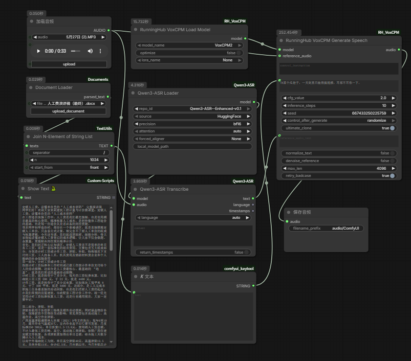

# ComfyUI-Qwen3-ASR-Enhanced-v0.1

ComfyUI custom nodes for **Qwen3-ASR** - audio-to-text transcription supporting 52 languages and dialects.

新增 **Qwen3-ASR-Enhanced-v0.1** 模型，支持非语言语音（如笑声、叹气、咳嗽等）的识别和转录。

> [!NOTE]
> This is based on [DarioFT/ComfyUI-Qwen3-ASR](https://github.com/DarioFT/ComfyUI-Qwen3-ASR), with additional support for the Enhanced model.

## Models

| Model | HuggingFace URL | Size | Notes |
|-------|----------------|------|-------|
| Qwen3-ASR-1.7B | [Qwen/Qwen3-ASR-1.7B](https://huggingface.co/Qwen/Qwen3-ASR-1.7B) | 1.7B | Best quality |
| Qwen3-ASR-0.6B | [Qwen/Qwen3-ASR-0.6B](https://huggingface.co/Qwen/Qwen3-ASR-0.6B) | 0.6B | Faster |
| **Qwen3-ASR-Enhanced-v0.1** | [mrfakename/Qwen3-ASR-Enhanced-v0.1](https://huggingface.co/mrfakename/Qwen3-ASR-Enhanced-v0.1) | 1.7B | **Enhanced** - 支持非语言语音识别 |

## What's New in Enhanced v0.1

- **非语言语音识别**: 支持笑声、叹气、咳嗽、清嗓等非语言声音的标注
- **增强转录精度**: 基于 Qwen3-ASR-1.7B 微调，提升特定场景识别准确率
- **Meta Tensor Fix**: 自动处理模型参数，避免 `NotImplementedError` 错误
- **自动设备迁移**: 模型加载后自动移至 GPU

## Workflow



Workflow JSON 文件: [examples/ComfyUI-Qwen3-ASR-Enhanced-v0.1.json](examples/ComfyUI-Qwen3-ASR-Enhanced-v0.1.json)

## Installation

### Via ComfyUI Manager
Search for "Qwen3-ASR" in ComfyUI Manager

### Manual Installation
```bash
cd ComfyUI/custom_nodes
git clone https://github.com/sddzwxy/ComfyUI-Qwen3-ASR-Enhanced-v0.1.git
cd ComfyUI-Qwen3-ASR-Enhanced-v0.1
pip install -r requirements.txt
```

## Nodes

### Qwen3-ASR Loader
Loads the ASR model with auto-download support.

| Input | Type | Description |
|-------|------|-------------|
| repo_id | dropdown | Select model (1.7B, 0.6B, or Enhanced-v0.1) |
| source | dropdown | HuggingFace or ModelScope |
| precision | dropdown | fp16, bf16, fp32 |
| attention | dropdown | auto, flash_attention_2, sdpa, eager |
| forced_aligner | dropdown | Optional aligner for timestamps |
| local_model_path | string | Optional custom model path |

### Qwen3-ASR Transcribe
Transcribes a single audio input to text.

| Input | Type | Description |
|-------|------|-------------|
| model | QWEN3_ASR_MODEL | Loaded model |
| audio | AUDIO | Audio input |
| language | dropdown | Force language or "auto" |
| context | string | Optional context hints |
| return_timestamps | boolean | Enable timestamp output |

### Qwen3-ASR Batch Transcribe
Batch transcription for multiple audio files.

## Supported Languages

Chinese, English, Cantonese, Arabic, German, French, Spanish, Portuguese, Indonesian, Italian, Korean, Russian, Thai, Vietnamese, Japanese, Turkish, Hindi, Malay, Dutch, Swedish, Danish, Finnish, Polish, Czech, Filipino, Persian, Greek, Hungarian, Macedonian, Romanian

Plus 22 Chinese dialects including Sichuan, Cantonese (HK/Guangdong), Wu, Minnan, and regional accents.

## Credits

- [Qwen3-ASR](https://huggingface.co/Qwen/Qwen3-ASR-1.7B) by Alibaba Qwen Team
- [Qwen3-ASR-Enhanced-v0.1](https://huggingface.co/mrfakename/Qwen3-ASR-Enhanced-v0.1) by mrfakename
- [qwen-asr](https://pypi.org/project/qwen-asr/) Python package
- [DarioFT/ComfyUI-Qwen3-ASR](https://github.com/DarioFT/ComfyUI-Qwen3-ASR) original ComfyUI node

## License

Apache-2.0
